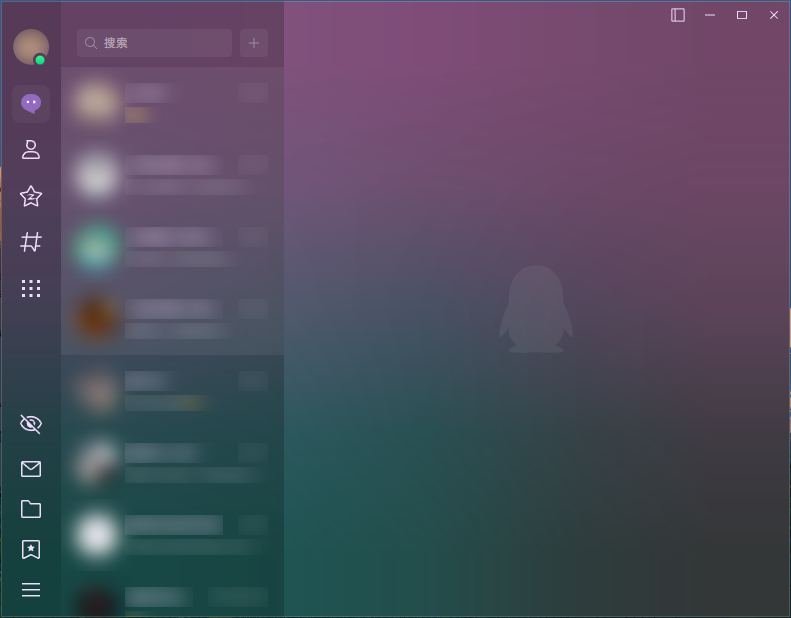

# Quickly-Remove-Conversations

  
  
  
  

实现使用鼠标中键快速删除 QQNT 聊天会话功能，就像在各种软件中关闭标签页一样。

## 开源协议

本项目遵循 [MIT](https://opensource.org/licenses/MIT) 开源协议。

CopyRight © 2023 [Jiang Liu](https://coderjiang.com)